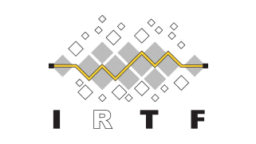
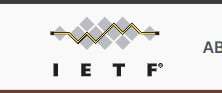
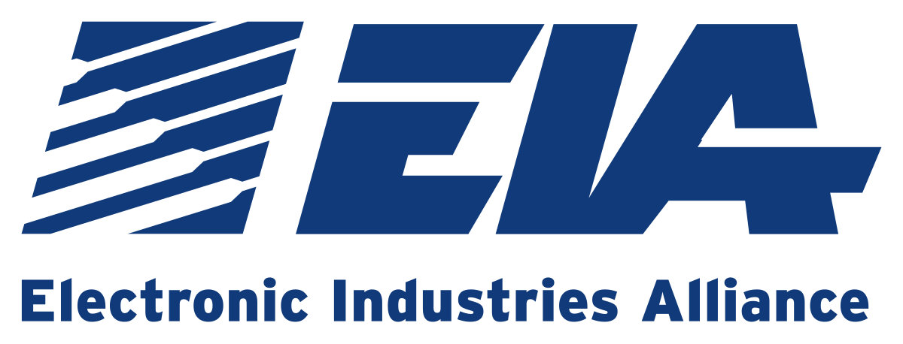

# Лабораторная работа 2.1
## Обзор организаций по стандартизации интернета

**Выполнил:** Калиновский Глеб [ИКПИ-41]  

---

## 1. Цель работы
Изучить основные международные и национальные организации, занимающиеся стандартизацией протоколов, архитектуры и сервисов сети Интернет, а также определить их роль в развитии глобальной сети.

---

## 2. Обзор организаций

---

### 2.1. ISOC (Internet Society) — Общество Интернета

| | |
|---|---|
| **Тип организации** | Международная некоммерческая организация |
| **Год основания** | 1992 год |
| **Штаб-квартира** | Рестон, Вирджиния (США) и Женева (Швейцария) |
| **Количество членов** | Более 28 000 индивидуальных членов и более 80 организаций из 180 стран мира |
| **Официальный сайт** | [https://www.internetsociety.org/](https://www.internetsociety.org/) |

**История и предпосылки создания:**  
ISOC была создана, чтобы обеспечить организационную и финансовую структуру для неформальных сообществ, занимающихся развитием интернета, таких как IETF. Винт Серф, Боб Кан и Лайман Чапин выпустили документ "Announcing ISOC", объясняющий необходимость создания организации, которая будет поддерживать техническую эволюцию интернета как исследовательской и образовательной инфраструктуры [citation:1].

**Основные направления деятельности [citation:1]:**
1. **Стандартизация** — поддержка и продвижение работы IETF, IAB, IESG и IRTF
2. **Публичная политика** — взаимодействие с правительствами и международными организациями для продвижения открытого интернета
3. **Образование** — проведение технических тренингов, семинаров и конференций, поддержка локальных интернет-организаций

**Дополнительные факты:**
- ISOC является материнской компанией для Public Interest Registry, управляющей доменом .ORG
- Организовала Всемирный день IPv6 (World IPv6 Day) с участием Facebook, Google, Yahoo и других компаний
- Имеет более 90 отделений (chapters) по всему миру, включая Россию и страны СНГ [citation:1]

---

### 2.2. IRTF (Internet Research Task Force) — Исследовательская группа интернет-технологий

| | |
|---|---|
| **Тип организации** | Исследовательское подразделение IAB |
| **Год основания** | 1989 год |
| **Руководство** | Председатель назначается IAB |
| **Официальный сайт** | [https://irtf.org/](https://irtf.org/) |

**Основное отличие от IETF:**  
Если IETF занимается разработкой стандартов для текущих нужд интернета, то IRTF фокусируется на долгосрочных исследованиях проблем, которые недостаточно документированы или слишком сложны для немедленной стандартизации [citation:2].

**Структура и организация [citation:2]:**
- Подразделяется на исследовательские группы (research groups)
- Группы могут быть открытыми или закрытыми (в отличие от всегда открытых групп IETF)
- Руководители групп назначаются председателем IRTF
- Результаты исследований передаются в IETF для последующей стандартизации

---

### 2.3. IETF (Internet Engineering Task Force) — Инженерный совет Интернета

| | |
|---|---|
| **Тип организации** | Открытое международное сообщество (без формального членства) |
| **Год основания** | 16 января 1986 года |
| **Штаб-квартира** | Фремонт, Калифорния (США) |
| **Количество участников** | Около 1200 человек на собраниях |
| **Официальный сайт** | [https://www.ietf.org/](https://www.ietf.org/) |

**История создания:**  
Первое собрание IETF состоялось 16 января 1986 года с участием 21 исследователя, спонсируемого правительством США. Первоначально встречи проводились ежеквартально, с 1991 года — три раза в год. Начиная с четвертого собрания, участие стало открытым для всех желающих [citation:3].

**Принципы работы IETF [citation:3]:**
1. **Открытое взаимодействие** — любой заинтересованный человек может участвовать в разработке
2. **Техническая компетентность** — решения принимаются на основе технической экспертизы
3. **Волонтёрство** — участники и руководство работают на добровольной основе
4. **"Примерное согласие и исполнимый код"** — стандарты создаются на основе консенсуса и практической реализации

**Структура [citation:3]:**
- Рабочие группы (Working Groups), объединенные в тематические области:
  - Прикладная область
  - Интернет-область
  - Область маршрутизации
  - Область безопасности
  - Транспортная область и др.
- IESG (Internet Engineering Steering Group) — управляющий орган
- IAB (Internet Architecture Board) — архитектурный надзор

**Результаты деятельности:**  
Все результаты оформляются в виде RFC (Request for Comments), которые затем ISOC кодифицирует как новые стандарты [citation:3][citation:9].

---

### 2.4. IEEE (Institute of Electrical and Electronics Engineers) — Институт инженеров электротехники и электроники

| | |
|---|---|
| **Тип организации** | Некоммерческая инженерная ассоциация |
| **Год основания** | 1963 год (слияние AIEE 1884 г. и IRE 1912 г.) |
| **Штаб-квартира** | США |
| **Количество членов** | Более 300 000 технических специалистов из 147 стран |
| **Официальный сайт** | [https://www.ieee.org/](https://www.ieee.org/) |

**История:**  
Образована в 1963 году в результате слияния Американского института инженеров-электриков (AIEE, основан в 1884) и Института радиоинженеров (IRE, основан в 1912) [citation:4][citation:10].

**Сфера деятельности [citation:4][citation:10]:**
- Крупнейшая в мире профессиональная организация
- Ведущая организация по стандартизации в области электротехники, электроники и компьютерных технологий
- Член ANSI и ISO
- Проводит и спонсирует технические конференции, симпозиумы и семинары
- Ведет большую издательскую и образовательную деятельность

**Основные стандарты в сфере сетей:**
- IEEE 802.3 — Ethernet
- IEEE 802.11 — Wi-Fi
- Множество стандартов в области программирования и инженерных систем

---

### 2.5. ICANN (Internet Corporation for Assigned Names and Numbers) — Корпорация по управлению доменными именами и IP-адресами

| | |
|---|---|
| **Тип организации** | Международная некоммерческая организация |
| **Год основания** | 18 сентября 1998 года |
| **Статус** | С 1 октября 2016 года — независимая международная организация |
| **Официальный сайт** | [https://www.icann.org/ru](https://www.icann.org/ru) |

**История создания [citation:5]:**
Создана при участии правительства США для регулирования вопросов, связанных с доменными именами и IP-адресами. Важную роль в создании сыграл Джон Постел (Jon Postel), автор многих ключевых RFC. Учредительный договор подписан 21 ноября 1998 года.

**Ключевые документы в истории [citation:5]:**
- 1972 год — RFC 349 Джона Постела "Предложение по стандартным номерам сокетов"
- 1983 год — RFC 882 Пола Мокапетриса "Доменные имена — концепции и технические средства"
- 1998 год — RFC 2468 Винта Серфа "Я помню IANA"
- 1998 год — "Белая книга" NTIA по управлению именами и адресами интернета

**Основные функции:**
- Координация уникальных идентификаторов интернета
- Распределение IP-адресов
- Управление корневыми DNS-серверами
- Администрирование доменных имен верхнего уровня

---

### 2.6. EIA (Electronic Industries Alliance) — Альянс электронной промышленности

| | |
|---|---|
| **Тип организации** | Добровольный союз производителей (США) |
| **Год основания** | 1924 год |
| **Штаб-квартира** | Вашингтон, США |
| **Официальный сайт** | [https://en.wikipedia.org/wiki/Electronic_Industries_Alliance](https://en.wikipedia.org/wiki/Electronic_Industries_Alliance) |

**История названия [citation:6]:**
Ранее была известна как RMA (Radio Manufacturers Association) или RETMA.

**Основная деятельность [citation:6]:**
- Стандартизация технических средств
- Разработка единых электрических и функциональных спецификаций интерфейсного оборудования
- Разработка телевизионных стандартов, используемых в США, Канаде и Японии (525 строк)

**Ключевые стандарты серии RS (Recommended Standards) [citation:6]:**
- **RS-232C** — последовательный интерфейс (стандарт EIA232-D)
- **RS-422**
- **RS-423**
- **RS-449**
- **RS-485**

Эти стандарты регламентируют электрические и функциональные характеристики интерфейсного оборудования и кабельных систем.

---

### 2.7. ITU (International Telecommunication Union) — Международный союз электросвязи

| | |
|---|---|
| **Тип организации** | Специализированное учреждение ООН |
| **Год основания** | 17 мая 1865 года (как Международный телеграфный союз) |
| **Статус в ООН** | С 1947 года — специализированное учреждение |
| **Штаб-квартира** | Женева, Швейцария |
| **Членство** | 193 страны-участницы и более 700 членов по секторам |
| **Официальный сайт** | [https://www.itu.int/ru/](https://www.itu.int/ru/) |

**Историческое значение [citation:7]:**
ITU — одна из старейших ныне существующих международных организаций. С 1849 года телеграфная связь стала межгосударственной, что потребовало совместимости оборудования в разных странах. 17 мая 1865 года в Париже 20 государств (включая Россию) приняли первую Международную телеграфную конвенцию и основали Международный телеграфный союз.

**Современная структура (с 1992 года) [citation:7]:**
1. **ITU-R (МСЭ-R)** — Сектор радиосвязи (преемник МККР и МКРЧ)
2. **ITU-T (МСЭ-Т)** — Сектор стандартизации электросвязи (преемник МККТТ)
3. **ITU-D (МСЭ-D)** — Сектор развития электросвязи

**Основные задачи [citation:7]:**
- Обеспечение для каждого человека доступного доступа к информации и связи
- Разработка стандартов (рекомендаций) для инфраструктуры электросвязи
- Управление использованием радиочастотного спектра и спутниковых орбит
- Поддержка стран в развитии электросвязи

**Дополнительные факты:**
- Ежегодно рассчитывает Индекс развития ИКТ (ICT Development Index) по странам мира [citation:7]
- Рекомендации ITU не являются обязательными, но широко поддерживаются, так как обеспечивают совместимость сетей по всему миру

---

## 3. Сводная таблица

| Аббревиатура | Полное название | Год основания | Специализация | Статус |
|:---:|:---|:---:|:---|:---|
| **ISOC** | Internet Society | 1992 | Развитие и доступность интернета | Международная некоммерческая |
| **IRTF** | Internet Research Task Force | 1989 | Исследования сетевых технологий | Подразделение IAB |
| **IETF** | Internet Engineering Task Force | 1986 | Стандарты протоколов (RFC) | Открытое сообщество |
| **IEEE** | Institute of Electrical and Electronics Engineers | 1963 | Стандарты Ethernet, Wi-Fi | Профессиональная ассоциация |
| **ICANN** | Internet Corporation for Assigned Names and Numbers | 1998 | Управление доменами и IP-адресами | Международная некоммерческая |
| **EIA** | Electronic Industries Alliance | 1924 | Стандарты интерфейсов (RS) | Промышленный альянс |
| **ITU** | International Telecommunication Union | 1865 | Регулирование связи и радиочастот | Учреждение ООН |

---

## 4. Вывод

В ходе выполнения лабораторной работы были изучены основные организации, занимающиеся стандартизацией интернета. Анализ показал, что каждая организация имеет свою уникальную историю и сферу ответственности:

1. **ISOC** выступает идеологическим и организационным лидером, объединяя сообщество разработчиков и обеспечивая поддержку IETF и других технических групп.

2. **IETF и IRTF** образуют тандем: IETF разрабатывает стандарты для текущих нужд, а IRTF занимается фундаментальными исследованиями для будущих технологий.

3. **IEEE** создает стандарты для аппаратного обеспечения сетей, без которых невозможна физическая передача данных.

4. **ICANN** обеспечивает уникальность адресации, что критически важно для глобальной маршрутизации.

5. **EIA и ITU** представляют разные уровни стандартизации: EIA — промышленные стандарты США, ITU — глобальное регулирование на уровне ООН.

Особенно показателен пример ITU как старейшей организации (1865 год), которая адаптировалась от регулирования телеграфа до современных телекоммуникаций. Благодаря деятельности всех этих организаций обеспечивается совместимость устройств и протоколов по всему миру, что позволяет интернету функционировать как единая глобальная сеть.

---

## 5. Галерея логотипов

  
  
  
  
  
  
  

